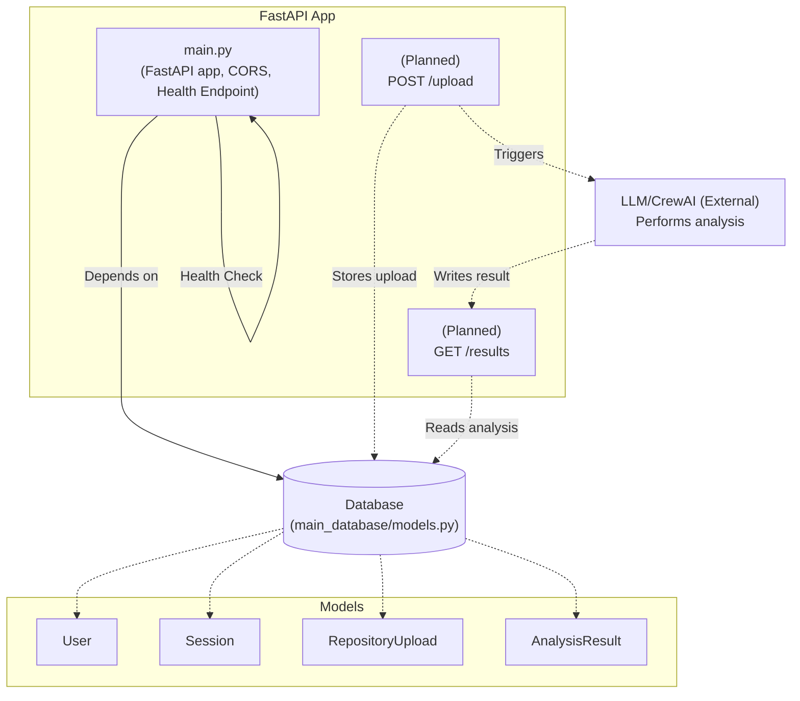

# Main Backend (FastAPI) Architecture and Features

## Overview

The `main_backend` service is the core logic engine for the CodeReview Assistant application. It uses FastAPI as its primary framework and is responsible for orchestrating user session management, processing Git repository uploads, invoking productivity tools such as automatic commit message generation, code optimization, issue detection, and coordinating with the LLM/CrewAI-based subsystems. All backend functionalities are accessible through a REST API, making it easy to integrate with other frontends or services.

---

## Core Architecture

### FastAPI Application

The backend is structured as a FastAPI application, with CORS enabled to support cross-origin frontends. The main entry point is:

- **File:** `main_backend/src/api/main.py`
- Initializes the FastAPI app.
- Adds CORS middleware to support broad integration.
- Defines a health check endpoint (`GET /`).

### REST API Endpoints

At present, the direct implementation exposes only a health check endpoint at the root (`/`). All further endpoints (e.g., file upload, results retrieval, session management) are planned and described at a high level in this document, as the scaffold is present but specific endpoint implementations for file uploads and LLM interaction are not yet found in the codebase.

#### Example of Health Check Endpoint

```python
@app.get("/")
def health_check():
    return {"message": "Healthy"}
```

---

## Feature Handling

### User Sessions

Sessions are handled via a database shared with the `main_database` container, using SQLAlchemy ORM models:

- **Session Model:** Defines session tokens, their creation, expiry, and association to users.
- All authentication and session tracking are intended to be managed through this persistent model.
- (Implementation code in `main_database/models.py`.)

### File Uploads (Git Repository Path Input)

The backend is designed to accept directory paths to uploaded Git repositories:

- While the endpoint for file uploads is not explicitly present in the current FastAPI code, `RepositoryUpload` model in the database is set up to track each upload (user, repository path, timestamp).
- Once the upload endpoint is added, it will be able to store analysis jobs and launch processing.

### Commit Message Generation, Code Optimization, Issue Detection

These productivity features are achieved by analyzing uploaded repositories, diffs, and project metadata. The backend is designed to:

- Store each analysis request and result in the `AnalysisResult` model.
- Support LLM-based or heuristic-driven generation of commit messages, code improvement suggestions, and problem detection.
- Store raw LLM results and processed outputs in a normalized schema.

### Integration with LLM/CrewAI

The backend architecture is built to connect with LLMs (such as those from CrewAI):

- Results (commit messages, code suggestions, issues) are stored in a JSON field in the database.
- While the coordination code for actual LLM interaction is not present in this codebase version, the architecture and models expect an external AI agent to perform the analysis and write back the results.
- Future expansions would likely introduce endpoints to dispatch LLM requests and retrieve results.

---

## Database Design & Data Flow

The backend depends on the `main_database` service for persistent storage. Key ORM models include:

- **User:** Registered users.
- **Session:** Authentication tokens.
- **RepositoryUpload:** Each incoming Git repository event.
- **AnalysisResult:** Output from LLM/code review analyses, including commit messages, optimizations, and detected issues represented as JSON.

ORM and database utilities are assembled in `main_database/db.py` and `models.py`, with a SQLAlchemy session provided as a FastAPI dependency.

---

## Backend Component Diagram (Mermaid)



---

## Notable Files

| File Path                                                   | Purpose                                    |
|-------------------------------------------------------------|--------------------------------------------|
| `main_backend/src/api/main.py`                              | FastAPI app, middleware, health check      |
| `main_database/models.py`                                   | Database ORM for users, sessions, uploads, analysis results |
| `main_database/db.py`                                       | DB connection and session management       |

---

## Summary and Intended Extensions

This backend provides a modular, extensible foundation for code review and productivity features powered by LLMs. While some endpoints and business logic (e.g., file uploads, interaction with CrewAI) are yet to be implemented, the architectural scaffolding via both code and ORM models ensures straightforward future development and integration.

**Features currently architected:**
- User/session management
- Repository upload recording
- Analysis (commit message/code suggestions/issue detection) lifecycle
- REST API base; backend can be extended with additional endpoints as required
- Prepared for AI integration, database storage, and cross-origin client use

---
